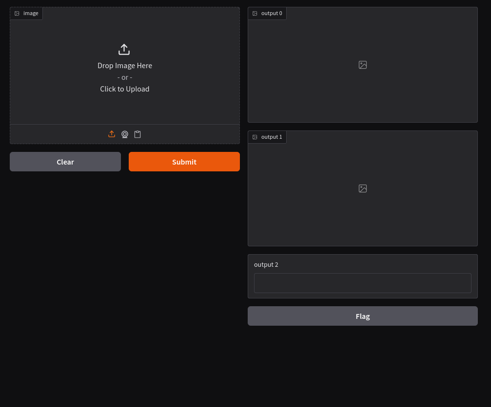

# Salient Object Detection

A CNN-based salient object detection (SOD) system built from scratch in PyTorch. Given an input image, the model predicts a binary mask highlighting the most visually important region — the part that naturally draws human attention.

Built as an end-to-end ML/DL project: data pipeline, custom CNN architecture, training loop, evaluation, and an interactive Gradio demo.



---

## Results

Six experiments were run, progressively adding improvements over the baseline:

| Run | Model | Dataset | Batch Norm | Augmentation | Image Size | IoU | Precision | Recall | F1 |
|---|---|---|---|---|---|---|---|---|---|
| 1 | Baseline | ECSSD | no | no | 128×128 | 0.3296 | 0.5894 | 0.4315 | 0.4938 |
| 2 | Baseline | ECSSD | no | no | 224×224 | 0.3012 | 0.5387 | 0.4092 | 0.4609 |
| 3 | Baseline | ECSSD | yes | no | 128×128 | 0.4028 | 0.6236 | 0.5322 | 0.5737 |
| 4 | Baseline | ECSSD | yes | yes | 128×128 | 0.4309 | 0.5981 | 0.6094 | 0.6013 |
| 5 | Baseline | MSRA10K | yes | yes | 128×128 | 0.6110 | 0.7141 | 0.8087 | 0.7578 |
| 6 | **U-Net** | **MSRA10K** | **yes** | **yes** | **128×128** | **0.6780** | **0.7945** | **0.8221** | **0.8075** |

Best model: U-Net with skip connections, batch normalization, data augmentation, trained on MSRA10K (10,000 images).

Key takeaways:
- Adding batch norm gave the biggest single-change improvement on the small dataset (+0.08 F1)
- Switching to MSRA10K (10× more data) was a larger jump than any architecture tweak (+0.16 F1)
- U-Net skip connections gave a further +0.05 F1 on top of the larger dataset

---

## Demo

The included Gradio app lets you upload any image and see the predicted saliency mask + overlay in real time, along with inference time.

```bash
python app.py
```

The app loads the best trained checkpoint (`checkpoints/best_model.pth`) and serves a UI at `http://127.0.0.1:7860`.

---

## Setup

Tested on Fedora 40 with Python 3.12, CUDA 12.8, RTX 3060 (6GB VRAM).

```bash
git clone https://github.com/ArbisonKrasniqi/salient-object-detection.git
cd salient-object-detection

python -m venv .venv
source .venv/bin/activate

pip install -r requirements.txt
```

GPU is recommended for training but not required. The model will fall back to CPU automatically if CUDA is not available (inference will be slower).

---

## How to Run

### Training

```bash
python train.py
```

Trains the model on the configured dataset and saves the best checkpoint (by validation loss) to `checkpoints/best_model.pth`. Per-epoch loss is printed to the console.

### Evaluation

```bash
python evaluate.py
```

Loads the best checkpoint and reports IoU, Precision, Recall, and F1 on the test set. Also generates a visualization (`evaluation_preview.png`) showing input images, ground-truth masks, predictions, and overlays for a random batch.

### Demo

```bash
python app.py
```

Launches the interactive Gradio app. Drag and drop any image to see the model's prediction.

---

## Project Structure

```
salient-object-detection/
├── data_loader.py          # Dataset class, train/val/test split, augmentation
├── sod_model.py            # Baseline encoder-decoder CNN
├── unet_sod_model.py       # U-Net with skip connections (best model)
├── train.py                # Training loop with checkpointing
├── evaluate.py             # Metrics + visualization
├── app.py                  # Gradio demo
├── checkpoints/            # Saved model weights (gitignored)
├── data/                   # ECSSD dataset (gitignored)
├── data_msra/              # MSRA10K dataset (gitignored)
└── requirements.txt
```

---

## Datasets

Two public SOD datasets were used.

### ECSSD (Extended Complex Scene Saliency Dataset)

- 1,000 images with pixel-accurate binary saliency masks
- Used for initial baseline experiments and architecture iteration
- Variable image dimensions, resized to 128×128 during loading

### MSRA10K

- 10,000 images with binary saliency masks
- Used for final training runs (Runs 5 and 6) once the pipeline was stable
- Filenames were normalized to a zero-padded sequential format (`0001.jpg` ↔ `0001.png`) to match the existing `data_loader.py` pairing logic — see `rename_msra.py`

Both datasets use a 70/15/15 train/val/test split with `seed=42` for reproducibility.

Datasets are not included in the repo (gitignored due to size). Download separately from their respective sources.

---

## Tech Stack

- **Language:** Python 3.12
- **Framework:** PyTorch 2.11
- **Libraries:** torchvision, NumPy, Pillow, Matplotlib, Gradio
- **Hardware:** NVIDIA RTX 3060 Laptop (6GB VRAM), CUDA 12.8
- **OS:** Fedora 40

---

## Notes

This project was built as a learning exercise — every component (data pipeline, model, training loop, metrics) was implemented from scratch without using pretrained weights. The goal was understanding the full deep learning pipeline, not chasing state-of-the-art numbers.